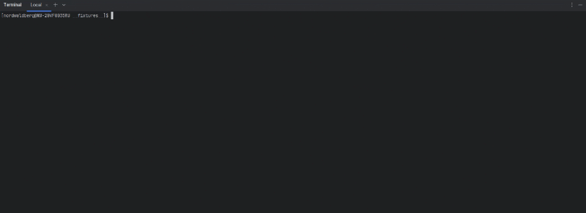

# gendiff
___

> ### **Utility for comparing two data structures** </br> 
> 
> Supports two file formats: **JSON**, **YAML** </br>
> Supports three report formats: **plain text**, **stylish** and **json**
___

[](https://github.com/nordwaldberg/backend-project-46/actions)

[](https://sonarcloud.io/summary/new_code?id=nordwaldberg_backend-project-46)
[](https://sonarcloud.io/summary/new_code?id=nordwaldberg_backend-project-46)
[](https://sonarcloud.io/summary/new_code?id=nordwaldberg_backend-project-46)<br/>
[](https://sonarcloud.io/summary/new_code?id=nordwaldberg_backend-project-46)
[](https://sonarcloud.io/summary/new_code?id=nordwaldberg_backend-project-46)
[](https://sonarcloud.io/summary/new_code?id=nordwaldberg_backend-project-46)<br/>

___

### ◽ installation
___
#### 1. clone this repository to your local machine in any convenient way, for example:
```
git clone [repo URL]
```
#### 2. install dependencies
```
make install
```
#### 3. install the package locally
```
npm link
```
___

### ◽ usage
```
 gendiff [options] <filepath1> <filepath2>
```
> options: </br>
> -V, --version        output the version number </br>
> -f, --format <type>  output format </br>
> -h, --help           display help for command </br>

<div style="text-align: center">
    
</div>
___